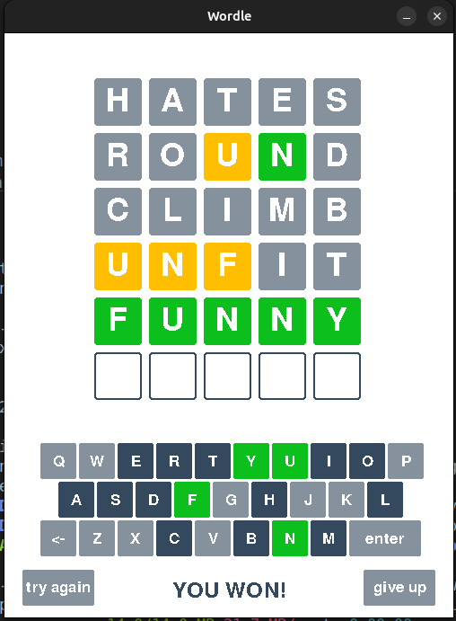

# Wordle Game in Python and Pygame

## Project Objective

The goal of this project is to implement a Wordle game based on English words, featuring a graphical interface. Players can enter letters either by clicking the on-screen keyboard or typing them using a physical keyboard.

## Word Lists

The game relies on two text files:

- `guesswords.txt` – Used for generating secret words (sourced from [here](https://github.com/LaurentLessard/wordlesolver/blob/main/solutions_nyt.txt) and edited).
- `valid_words.txt` – Used for checking valid input words (sourced from [here](https://gist.github.com/dracos/dd0668f281e685bad51479e5acaadb93) and edited).

## Technical Information

- The project is written in **Python 3.10.12**.

- Requires **pygame 2.5.2**.

## Installation

1. Ensure Python 3.10.12 is installed.

2. Install the required library: `pip install pygame`.

## How to Play

1. Run `main.py`.

2. Enter a 5-letter English word using:

    - Your physical keyboard.

    - The on-screen keyboard (by clicking the buttons).

3. Press _Enter_ to submit the word.

4. If the word is invalid, use _Backspace_ to delete it and try again.

## Game Rules

- Players have **6 attempts** to guess the correct word.

- The game provides color-coded hints following standard _Wordle_ rules:

    - **Green** – Letter is correct and in the right position.

    - **Yellow** – Letter is in the word but in the wrong position.

    - **Gray** – Letter is not in the word.

- **Winning**: If all letters turn green, caption _**YOU WON!**_ is displayed.

- **Losing**: After 6 failed attempts, the correct word is revealed.

# Game Options

- **Try Again** – Starts a new game.

- **Give Up** – Reveals the correct word and ends the current game.

## Code behind the game

### Class Structure

- **Database** – Loads word lists from text files, validates them, ensures proper formatting, and sorts them for efficient searching.

- **Guesswords** – Inherits from Database, loads possible solution words (guesswords.txt), and selects a random secret word.

- **ValidWords** – Inherits from Database, loads valid words (valid_words.txt), and allows quick verification of valid inputs.

- **Solution** – Handles the logic of a single Wordle game, checking guessed words and determining the appropriate color feedback.

- **Button** – Creates and displays interactive buttons on the screen.

### Testing

#### Binary Search Tests (ValidWords Class)

- Checking words that are not in the list.

- Checking words that are first or last in the list.

- Out-of-bounds cases.

#### Color Feedback Tests (Solution Class)

- Handling duplicate letters when only one is in the secret word.

- Handling cases in duplicates where second instance of a letter is correct.

- Verifying that a correct word turns all letters green.

### Reflection

Initially, I misunderstood Wordle’s color rules. For example, if the secret word is "EVADE" and the player enters "ABACK", my initial logic incorrectly marked the first 'A' as yellow instead of the second 'A' as green.

Despite this, I successfully implemented all planned features. Additionally, I introduced two new buttons: "Give Up" to surrender and "Try Again" to start a new game.

Enjoy solving puzzles and have fun with Wordle! 😊
